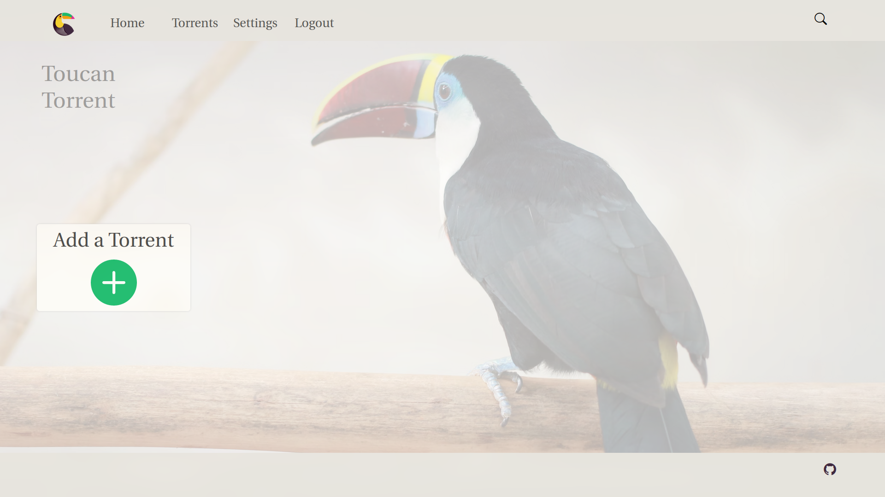
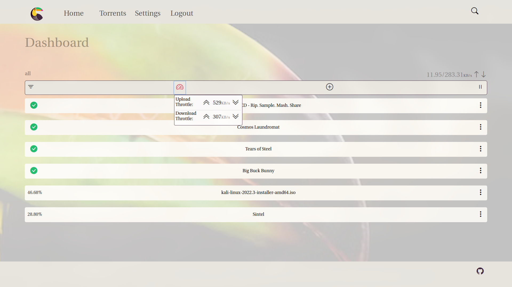

# Toucan Torrent





## Description:

Toucan is a browser based torrent client built to run within your LAN! Run it on your home server with the installation instructions below and enjoy it's benefits from any internet connected device, desktop or mobile.

## Installation:

Once you have your server hardware of choice and you have internet connectivity with an issued IP address from your router follow these instructions:

The app is built in node for a linux server, so we'll `use npm ci` and `npm start` after some prerequisites are handled

1. Build the database

```
mkdir database
touch db.sqlite
```

2. Since this is a web app, https is **required** for this app to function correctly. For this example, we will create and sign our own certs

**!WARNING!**   DO NOT CHANGE ANY OF THE NAMES HERE. The .pem files are read as they are from within app.js

```
cd database/
openssl genrsa -out key.pem
openssl req -new -key key.pem -out csr.pem
#click through all of the following options to fit your needs...
openssl x509 -req -days 9999 -in csr.pem -signkey key.pem -out cert.pem
```

3. From there we can now navigate back to our root project directory and download all of the dependencies like we normally would.

```
cd ../
npm ci
```

4. Run the client!

```
npm start
```

If you want to run it as a background process on your server, run it with nohup

`nohup npm start &`

From there just navigate to the ip address and specified port from another device in your LAN.

#### Developer notes:

- .env is located within config/.env if you want to set your own PORT variable
- Check package.json for the list of dev dependencies and run each one you need with npm i --save-dev <node-module>
  `ex: npm i --save-dev morgan`
- Scss is supported if you see the package.json feel free to use it

## How It's Made:

#### Tech Stack:

I used [Feathers](https://feathersjs.com/), [Node](https://nodejs.org/en/), [Express](https://expressjs.com/),[ & Sqlite](https://www.sqlite.org/index.html) to build out this project.
So I guess the...FNES stack? (pronounced finess)

Toucan is built on top of the WebTorrent API and offers real time updates from the Feathersjs framework.
The Feathers framework utilizes socket.io to deliver updates to and from the server. Another example use case for this functionality can be found in real time chats.
Sqlite is the database of choice. It's lightweight and very easy to make small changes for those familiar with SQL syntax.
I also utilized the Sequelize ORM tool to make insertion and queries a more seamless process. The whole app is routed with the Express framework, which integrates well
with Feathersjs. I COULD add a Frontend library/framework, but one of the original goals of this project was to learn more about frontend development without utilizing any tools
to make the process easier. With that said, I did add bootstrap because css styling can be notoriously tedious and I'm planning to transition over to React and jpx eventually.

## Roadmap:

When I have the time, there are some known bugs I want to address as well as features I would like to add:

#### Known Bugs:

- Pausing the client as well as individual torrents gives periodically strange behavior, for example the client has trouble pausing if there is only one torrent seeding.
- The CSP currently has the Embedder policy set to false, this is due to the fact that the Feathers url doesn't have an acceptabe CORSP, something that should be addressed.
- Currently if seeding torrent records are deleted, the search engine still includes those names in the results when they should be deleted.
- Torrent folders also do not get deleted from the datatabase when the seeding records are deleted, this causes the torrents folder to get bloated with inaccessible torrents.
- The CSS is a mess in my opinion. Since I had very limited time on this project's release (a month to be exact) I had to throw it all in a single stylesheet. This can be cleaned up overtime.
- The password visibility toggle on the login page isn't working properly. This should be a simple fix.
- When torrents are deleted. The client Feathers service is not removing those properties. This may not be much of an issue but it's not a clean solution.
- The torrent service has a similar issue to the client service, Torrents that are deleted are not being removed from the service object.

#### Future Features:

- It wouldn't be a WebTorrent based app without streaming services for music and video. I hope to add as many as the api offers in the future including chromecast and vlc support.
- I would like to add the same feature for e-book formats so books can be read straight from the site.
- For added layers of security I would like to address the current access controls, which are really nonexistent. Sure the app is meant to only be ran in a LAN for only other computers within that LAN to access. But adding some kind of administration system along with passport so an admin has more control over how other accounts are created is a more ideal solution.
- I'm thinking about adding a CI & CD process down the road so updates will always come to users seamlessly when pushed to main.

There are plenty of other things to address, but this roadmap should keep me busy for a while.

### Dependencies

[Node](https://nodejs.org/en/) |
[Feathers](https://feathersjs.com/) |
[Express](https://docs.feathersjs.com/api/express.html) |
[Express Flash](https://www.npmjs.com/package/express-flash) |
[Express Session](https://www.npmjs.com/package/express-session) |
[Express Session Sequelize](https://www.npmjs.com/package/express-session-sequelize) |
[SocketIo](https://docs.feathersjs.com/api/socketio.html) |
[Sqlite](https://www.sqlite.org/index.html) |
[Sqlite3 bindings](https://www.npmjs.com/package/sqlite3) | 
[Sequelize and sequelize-sore](https://www.npmjs.com/package//sequelize?activeTab=readme]) | 
[Bcrypt for Sequelize](https://www.npmjs.com/package//sequelize-bcrypt) | 
[Bootstrap 5](https://getbootstrap.com/docs/5.2/getting-started/introduction/) |
[Bootstrap Icons](https://icons.getbootstrap.com/) |
[Cookie Parser](https://www.npmjs.com/package/cookie-parser) |
[Cors](https://www.npmjs.com/package/cors) |
[dotenv](https://www.npmjs.com/package/dotenv) |
[Kiwi Maru](https://www.npmjs.com/package/@fontsource/kiwi-maru) |
[EJS](https://www.npmjs.com/package/ejs) |
[EJS Layouts for Express](https://www.npmjs.com/package/express-ejs-layouts) |
[Fs Extra](https://www.npmjs.com/package/fs-extra) |
[Helmet](https://www.npmjs.com/package/helmet) |
[Archiver](https://www.npmjs.com/package/archiver) |
[Method Override](https://www.npmjs.com/package/method-override) |
[Moment](https://www.npmjs.com/package/moment) |
[Multer](https://www.npmjs.com/package/multer) |
[Parse Torrent](https://www.npmjs.com/package/parse-torrent) |
[Passport](https://www.npmjs.com/package/passport) | 
[Passport Local](https://www.npmjs.com/package/passport-local) |
[Path](https://www.npmjs.com/package/path) |
[Validator](https://www.npmjs.com/package/validator) |
[Webtorrent](https://www.npmjs.com/package/webtorrent)

#### Dev dependencies

[Concurrently](https://www.npmjs.com/package/concurrently) |
[Morgan](https://www.npmjs.com/package/morgan) |
[Nodemon](https://www.npmjs.com/package/nodemon) |
[Sass](https://www.npmjs.com/package/scss) |
[crossenv](https://www.npmjs.com/package/cross-env)
